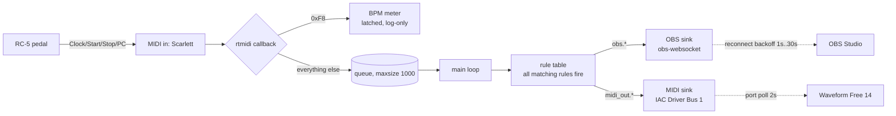
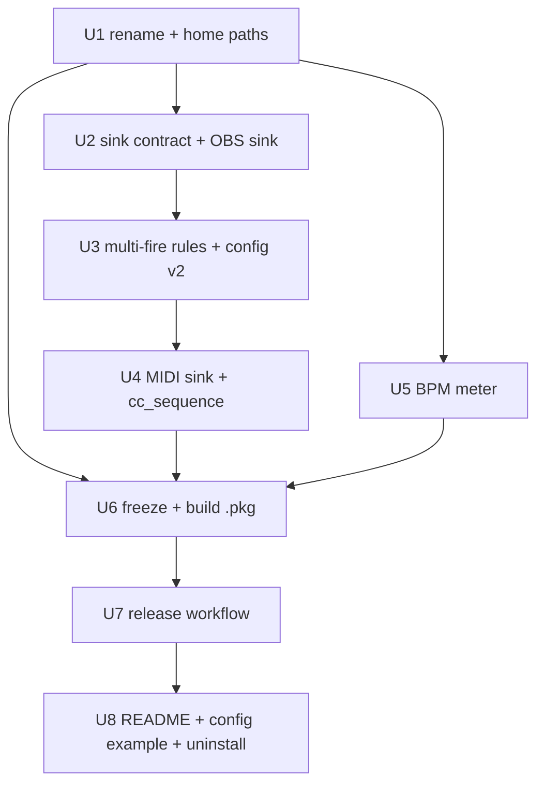

# feat: midi-pedald — multi-sink MIDI pedal daemon with self-contained .pkg

**Target repo:** `midi-pedald` (currently on disk as `midi-obs-recorder`)

## Summary

Merge two projects into one daemon. The existing `midi-obs-recorder` (tested, resilient,
launchd-managed) becomes the skeleton; the `midibridge.py` prototype's two behaviours —
Start/Stop → CC pairs on IAC for Waveform Free 14, and BPM measurement off the MIDI clock —
move in as a second sink and a clock tap. The prototype's code is not ported; its logic is.

One MIDI input feeds N independent sinks. Any sink can be absent, dead, or reconnecting
without affecting the others: OBS not running, Waveform not open, IAC bus missing, sound card
unplugged. The daemon polls and reconnects each independently and never exits.

Distribution changes from `install.sh` + venv to a downloadable, self-contained `.pkg` built
by GitHub Actions on tag. No Python on the target machine, no network at install time,
no signing yet.

---

## Problem Frame

Today the RC-5 pedal drives OBS only, via a daemon that must be installed by cloning the repo
and running a shell script that builds a venv. Waveform Free 14 gets nothing — it cannot chase
MIDI Clock in any edition, so the RC-5's raw `0xFA`/`0xFC` are invisible to its transport. The
one thing Waveform Free *does* accept is a Custom Control Surface over MIDI, learned to CC.

The claude.ai prototype solved the Waveform half but as a separate script with its own
resilience bugs (leaked `MidiIn` objects on every reconnect poll, thread-per-CC-pair, unguarded
shared BPM state) and its own launchd agent. Two daemons fighting over one MIDI port is not a
shipping shape — CoreMIDI inputs are shareable, but two agents, two configs, two logs and two
install paths for one pedal press is.

The daemon's architecture already solves every resilience bug in the prototype. The merge is
therefore mostly deletion: keep the skeleton, add one sink and one clock tap.

### Hardware chain (fixed, not a variable)

RC-5 (MIDI master: Clock `0xF8`, Start `0xFA`, Stop `0xFC`, PC) → Collider IN, THRU → Terraform
IN, THRU → Alesis SR-18 → Scarlett 18i16 MIDI IN → Mac. Daemon output: IAC Driver Bus 1.

### Established facts about Waveform Free 14 (do not re-research)

- No MIDI Clock reception in any edition, nor at the Tracktion Engine level.
- MTC is accepted but carries no tempo — tempo lives on the tempo track, unreachable by timecode.
- MMC is unlocked in Free, but rejected here: one CC pair is simpler and already the chosen path.
- Ableton Link (the only real tempo channel) is Pro-only. BPM therefore has nowhere to go but the log.
- No JavaScript Macro Editor in Free.
- One MIDI message maps to exactly one Waveform function — hence CC *pairs* for two-step actions.

---

## Requirements

- **R1.** One daemon, one MIDI input, N independent sinks; per-sink failure is isolated.
- **R2.** A single pedal press drives OBS recording and Waveform transport simultaneously.
- **R3.** Which pedal event drives which action stays a config edit, never a code edit.
- **R4.** BPM is derived from the clock stream and logged; the latch algorithm is preserved as designed.
- **R5.** Distribution is one downloadable `.pkg`; install requires no Python, no network, no Xcode CLT.
- **R6.** Everything the daemon owns lives under the user's home and is removable by deleting it.
- **R7.** The daemon never exits on any external failure. Preserved from the existing implementation.

---

## Naming

| Thing | Value |
|---|---|
| GitHub repo | `midi-pedald` |
| Python package | `pedald` |
| Executable | `pedald` |
| launchd label | `pro.kyxap.pedald` |
| Config | `~/Library/Application Support/pedald/config.yaml` |
| Bundle | `~/Library/Application Support/pedald/bin/` |
| Logs | `~/Library/Logs/pedald/` |

`midi-obs-recorder` / `midiobs` / `com.rc5.midiobs` disappear entirely. No compatibility shim —
the daemon has one user and no deployed installs to migrate.

---

## High-Level Technical Design

*This illustrates the intended approach and is directional guidance for review, not
implementation specification. The implementing agent should treat it as context, not code to
reproduce.*

### Data flow



The clock tap sits *before* the queue, in the callback, and consumes `0xF8` there. Clock never
reaches the queue, the rule table, or the logs — the existing drop guarantee is preserved, the
meter just reads the stream on its way to the floor.

### The sink contract

Two sinks, so no ABC — an informal contract, documented once in the daemon:

```
ensure_connected(now) -> bool    # own backoff/poll; never raises
dispatch(method, **params)       # no-op + one log line when disconnected; never raises
connected -> bool                # for logging only
```

`ObsController` already has this shape. `MidiSink` is written to match. The daemon holds
`{name: sink}` and does nothing else with them.

### Rule dispatch, before and after

| | Before | After |
|---|---|---|
| Matching | first match wins | **every** matching rule fires |
| Action | `start_record` | `obs.start_record` — `sink.method` |
| Params | none | optional `params:` dict passed as kwargs |
| Debounce | per rule | per rule, unchanged |
| `noop` action | shadows later rules | **removed** — nothing to shadow any more |

All-matching-fire is the one semantic break, and it is forced: a single `start` event must reach
two sinks. Per-rule debounce is what still protects against a doubled pedal press, so the
protection survives the change.

Rules dispatch in file order, synchronously, in the main loop. A `cc_sequence` with
`gap_ms: 50` therefore blocks the loop ~50 ms. This is fine and is the point: the rtmidi
callback only enqueues, so nothing is dropped, and the prototype's thread-per-pair — the source
of its unguarded-shared-state worry — is not needed. Put OBS rules above `midi_out` rules so
OBS is not delayed behind the gap.

### Config shape

```yaml
midi:
  port_substring: "Scarlett"

sinks:                          # a sink absent here is disabled;
  obs:                          # a rule naming a missing sink is a config error
    host: localhost
    port: 4455
    password: ""
  midi_out:
    port_substring: "IAC"

bpm:
  enabled: true
  window_ticks: 96              # 96 = one 4/4 bar
  tolerance: 1.5                # BPM dead-band
  confirm_windows: 2

logging:
  level: INFO
  file: "~/Library/Logs/pedald/pedald.log"
  max_bytes: 1048576
  backup_count: 3

rules:
  - { event: start, action: obs.start_record,  debounce_ms: 500 }
  - { event: start, action: midi_out.cc_sequence, debounce_ms: 500,
      params: { cc: [[22, 127], [20, 127]], gap_ms: 50 } }
  - { event: stop,  action: obs.stop_record,   debounce_ms: 500 }
  - { event: stop,  action: midi_out.cc_sequence, debounce_ms: 500,
      params: { cc: [[21, 127], [22, 127]], gap_ms: 50 } }
```

CC 20 = record, 21 = stop, 22 = rewind — arbitrary numbers, learned on the Waveform side.

---

## Output Structure

```
midi-pedald/
├── pedald/
│   ├── __init__.py
│   ├── __main__.py
│   ├── bpm.py              # new: pure clock->BPM logic
│   ├── cli.py
│   ├── config.py
│   ├── daemon.py
│   ├── mapping.py
│   ├── midi_sink.py        # new
│   └── obs_sink.py         # was obsctl.py
├── packaging/
│   ├── pedald.spec         # PyInstaller
│   ├── distribution.xml    # productbuild domains
│   ├── postinstall         # launchd agent + first-run config
│   └── build-pkg.sh        # freeze + pkgbuild + productbuild
├── .github/workflows/release.yml
├── tests/
│   ├── conftest.py, fakes.py
│   ├── test_bpm.py         # new
│   ├── test_config.py
│   ├── test_mapping.py
│   ├── test_midi_sink.py   # new
│   └── test_obs_sink.py    # was test_obsctl.py
├── config.example.yaml
├── requirements.txt
├── uninstall.sh
└── README.md
```

`install.sh` and `launchd/com.rc5.midiobs.plist.template` are deleted — the `.pkg` replaces both.

---

## Key Technical Decisions

**Sinks are objects, not functions.** Each owns connection state and its own retry clock, which
is state a function cannot hold. Two implementations, so no base class — the contract is three
names, documented in `daemon.py`.

**All matching rules fire.** Forced by R2. The alternative — keeping first-match and bolting
Waveform on as a hardcoded hook beside the rule engine — means two mechanisms for one concept
and a third sink would need a third mechanism.

**BPM taps the callback thread, not the queue.** The meter is two clock reads and an integer
counter per window; it cannot meaningfully block the callback, and keeping it out of the queue
preserves the "clock never reaches any logic" guarantee. All BPM state is touched from that one
thread only, which is what removes the prototype's race worry rather than papering over it.

**The BPM algorithm is not redesigned.** Two clock reads per window plus a tick count (jitter
does not accumulate, so there is nothing to filter), and a latch that only moves when the
deviation clears the dead-band in two consecutive windows. Tempo changes by tap between takes —
discrete events with a constant between them, not a noisy continuous signal. Do not replace this
with a median-of-deltas.

**PyInstaller `--onedir`, arm64 only.** `--onefile` unpacks to a temp dir on every launch, which
under `KeepAlive` is pure waste. Universal2 is deferred until someone needs Intel.
`mido.backends.rtmidi` must be an explicit `--hidden-import`: mido resolves backends by string
and PyInstaller's import graph cannot see it ([mido#426](https://github.com/orgs/mido/discussions/426)).

**User-domain `.pkg`.** `<domains enable_currentUserHome="true" enable_localSystem="false"/>`
installs into `$HOME` without root and without console-user detection, and satisfies R6 —
uninstall is one directory plus one plist. This attribute is documented but reported flaky
([Apple DevForums](https://developer.apple.com/forums/thread/664354)); see Risks for the fallback.

---

## Implementation Units



### U1. Rename to `pedald` and move all paths under the user's home

**Goal:** `midiobs` → `pedald` everywhere; every runtime path points into `~/Library/`.

**Requirements:** R6

**Dependencies:** none

**Files:** `midiobs/` → `pedald/` (all modules), `midiobs/obsctl.py` → `pedald/obs_sink.py`,
`tests/test_obsctl.py` → `tests/test_obs_sink.py`, `tests/conftest.py`, `tests/fakes.py`,
`config.example.yaml`, `requirements.txt`, `.gitignore`; delete `install.sh` and
`launchd/com.rc5.midiobs.plist.template`.

**Approach:** Mechanical rename plus a config-path default: when `--config` is absent, resolve
`~/Library/Application Support/pedald/config.yaml`. Default log path becomes
`~/Library/Logs/pedald/pedald.log`. The old `install.sh` and plist template die here rather than
being carried to U6 and rewritten — U6 writes fresh packaging.

**Patterns to follow:** existing `_setup_logging` in `cli.py` already expands `~`; keep that.

**Test scenarios:**
- Existing 28 tests pass unchanged after import renames — this unit changes no behaviour.
- `--config` omitted resolves to the Application Support path (expanded, absolute).
- `--config` given as a relative path is honoured as-is, not rewritten to the home default.

**Verification:** full test suite green; `python -m pedald --version` runs; no string
`midiobs` or `com.rc5` remains in the tree.

---

### U2. Formalise the sink contract and adapt the OBS sink

**Goal:** `ObsController` satisfies `ensure_connected` / `dispatch(method, **params)` /
`connected`, and the daemon drives a sink registry instead of one hardcoded controller.

**Requirements:** R1, R7

**Dependencies:** U1

**Files:** `pedald/obs_sink.py`, `pedald/daemon.py`, `tests/test_obs_sink.py`

**Approach:** `dispatch` changes from `dispatch(action)` to `dispatch(method, **params)` — OBS
methods take no params, so the kwargs are accepted and ignored there. The daemon gains
`self.sinks: dict[str, sink]`, built from config; `run()` calls `ensure_connected(now)` on every
sink each tick instead of on `self.obs`. Document the three-name contract as a comment at the
registry, not as an ABC. Existing behaviour — backoff 1s→30s, `GetRecordStatus` guards,
`SplitRecordFile` capability gate, request-errors not dropping the socket — is unchanged.

**Patterns to follow:** the existing `_GATED` capability map and `_is_request_error` name-match
trick in `obsctl.py`; keep both.

**Test scenarios:**
- Every existing OBS test passes against the new `dispatch(method)` signature.
- `dispatch` with unexpected kwargs on an OBS method does not raise.
- Daemon with two sinks where one factory raises on construction: the other still receives its
  dispatches, and `run()` does not exit.
- Daemon with an empty sink registry: `run()` loops and drops events with a log line, no crash.

**Verification:** OBS tests green; a daemon-level test drives two fake sinks and observes both.

---

### U3. All-matching-rule dispatch, `sink.method` actions, config v2

**Goal:** one event reaches every matching rule; actions are namespaced; config carries a
`sinks:` block and per-rule `params`.

**Requirements:** R2, R3

**Dependencies:** U2

**Files:** `pedald/mapping.py`, `pedald/config.py`, `pedald/daemon.py`,
`tests/test_mapping.py`, `tests/test_config.py`, `config.example.yaml`

**Approach:** `RuleTable.decide()` → `decide_all()` returning a list of `Decision`. Per-rule
debounce logic is untouched — it just runs for each matching rule instead of stopping at the
first. `Rule` gains `params: dict` and its `action` splits on the first `.` into
`(sink_name, method)`. The `ACTIONS` whitelist in `config.py` is replaced by validation against
the declared `sinks:` block: unknown sink prefix, or a method the sink does not expose, is a
`ConfigError` at load. The `noop` action is deleted — it existed only to shadow later rules under
first-match, and there is nothing left to shadow. `obs:` at config top level becomes
`sinks.obs:`.

**Execution note:** this unit inverts the core matching semantics of a tested module. Write the
multi-fire and per-rule-debounce-under-multi-fire tests first, then change `decide`.

**Test scenarios:**
- One `start` event matching two rules on different sinks returns both decisions, in file order.
- Two rules on the *same* sink both matching one event: both fire; the sink receives two dispatches.
- Debounce under multi-fire: rule A debounced, rule B not — only B's decision comes back.
- Debounce is still per rule: firing rule A does not debounce rule B on the same event.
- No matching rule returns an empty list with the "no rule matched" reason preserved for DEBUG.
- Clock still maps to kind `other` and matches nothing.
- Config: `action: obs.start_record` with `sinks.obs` declared → valid.
- Config: `action: midi_out.cc_sequence` with no `sinks.midi_out` block → `ConfigError` naming
  the missing sink.
- Config: `action: obs.explode` → `ConfigError` naming the unknown method.
- Config: bare `action: start_record` with no sink prefix → `ConfigError`.
- Config: `params` present on a method that takes none → `ConfigError` rather than a runtime `TypeError`.
- Existing PC-exact, PC-range, CC-value-range, and inverted/negative validation tests still pass.

**Verification:** mapping and config suites green; `config.example.yaml` loads clean.

---

### U4. MIDI output sink with `cc_sequence`

**Goal:** a sink that holds an output port open on IAC, reopens it when it disappears, and emits
timed CC sequences.

**Requirements:** R1, R2, R7

**Dependencies:** U3

**Files:** `pedald/midi_sink.py`, `tests/test_midi_sink.py`, `config.example.yaml`

**Approach:** `mido.open_output()` matched by case-insensitive substring, mirroring the input
side. `ensure_connected(now)` polls `mido.get_output_names()` every 2 s when disconnected and
verifies the held port's name is still present when connected. Methods: `cc_sequence(cc, gap_ms)`
sending each `[0xB0 | channel, num, val]` with `time.sleep(gap_ms/1000)` *between* messages
(not after the last), and `note(...)` is **not** built — YAGNI until Waveform needs it. Raw
`rtmidi` from the prototype is not used; the project is on `mido` and `midi_sink` matches the
input side's idiom. Sending on a vanished port drops the port and logs once, never raises.

**Execution note:** the prototype's port-liveness check leaked a `MidiIn` per poll. Mirror
`daemon._ensure_port`'s name-list check instead — it allocates nothing.

**Test scenarios:**
- `cc_sequence([[22,127],[20,127]], gap_ms=50)` sends exactly two messages, in order, with the
  right status/controller/value bytes.
- Gap is applied between messages and not after the last (fake sleep records one call for two CCs).
- Dispatch while disconnected sends nothing, logs, and does not raise.
- Port absent at startup: `ensure_connected` returns False, retries on the next poll window,
  succeeds once the fake port list contains a match.
- Port disappears while held: the next `ensure_connected` drops it and the following one reopens.
- Port poll respects the 2 s window — two calls inside one window produce one scan.
- The underlying send raising mid-sequence drops the port and does not propagate.
- Empty `cc` list is a no-op, not an error.

**Verification:** `test_midi_sink.py` green against a fake `mido` module (no IAC bus, no hardware).

---

### U5. BPM meter off the clock stream

**Goal:** derive tempo from `0xF8` and log it when the latched value moves.

**Requirements:** R4

**Dependencies:** U1

**Files:** `pedald/bpm.py`, `pedald/daemon.py`, `tests/test_bpm.py`, `config.example.yaml`

**Approach:** `bpm.py` is pure logic with zero third-party imports, matching `mapping.py`'s
pattern so it tests on plain `python3`. A `BpmMeter` object takes `window_ticks`, `tolerance`,
`confirm_windows`, a `now` callable and sane BPM bounds (40–250); `tick()` is called from
`daemon._on_midi` on `0xF8` **before** the clock is dropped, and returns the new latched BPM or
`None`. Window close: `bpm = 60 * window_ticks / (24 * elapsed)`, out-of-range windows discarded
without disturbing the latch. Latch: first window latches immediately; a window inside the
dead-band clears any pending candidate; outside it, a candidate must repeat within tolerance for
`confirm_windows` consecutive windows before the latch moves. Start `0xFA` resets the window
counter. The daemon logs at INFO only on a returned value. Disabled by config → the meter is not
constructed and `tick()` is never called.

**Technical design** *(directional, not specification)*:

```
tick():                          window boundary:
  if t0 is None: t0 = now(); n=0    bpm = 60*W / (24*(now()-t0))
  n += 1                            t0 = now(); n = 0
  if n < W: return None             if not 40 <= bpm <= 250: return None
  ...                               return on_window(bpm)   # latch logic
```

**Test scenarios:**
- 96 ticks at exact 120 BPM spacing on a fake clock latches 120 and returns it once.
- A second window at 120.4 (inside a 1.5 dead-band) returns `None` — no re-log of a steady tempo.
- A step to 140 held for two consecutive windows returns 140 on the second; the first returns `None`.
- A single 140 window followed by a return to 120 never moves the latch (confirm not met).
- A 140 window followed by a 200 window resets the candidate rather than confirming — two
  *different* out-of-band values do not add up to a confirmation.
- A window computing to 15 BPM or 900 BPM is discarded and leaves the latch untouched.
- One dropped tick in a window (three THRU pedals in the chain) skews the window low by ~2%;
  assert this stays inside the dead-band at 120 BPM and does not move the latch. This is the
  scenario the confirm-window rule exists for.
- `0xFA` mid-window resets the counter; the partial window never produces a value.
- First-ever tick returns `None` and starts the window rather than dividing by zero.
- Meter disabled in config: `daemon._on_midi` on a clock message touches no BPM state and the
  message is still dropped before the queue.

**Verification:** `test_bpm.py` green on plain `python3`; DEBUG run against `--monitor
--show-clock` output shows a plausible tempo.

---

### U6. Freeze to a self-contained bundle and build the `.pkg`

**Goal:** `packaging/build-pkg.sh` produces `midi-pedald-<version>.pkg` that installs a working
daemon into `$HOME` with no Python, no network, no venv.

**Requirements:** R5, R6

**Dependencies:** U1, U4, U5

**Files:** `packaging/pedald.spec`, `packaging/distribution.xml`, `packaging/postinstall`,
`packaging/build-pkg.sh`, `requirements.txt`

**Approach:** PyInstaller `--onedir`, arm64, with `mido.backends.rtmidi` as an explicit hidden
import. Payload rooted so it lands at `Library/Application Support/pedald/bin/`. `pkgbuild`
builds the component, `productbuild` applies `distribution.xml` carrying
`<domains enable_currentUserHome="true" enable_localSystem="false" enable_anywhere="false"/>`.
`postinstall` creates `~/Library/Logs/pedald/`, writes `config.yaml` from the bundled example
**only if absent** (an upgrade must never clobber a tuned config), renders
`~/Library/LaunchAgents/pro.kyxap.pedald.plist` with absolute paths, and
`launchctl bootout` + `bootstrap gui/$(id -u)` — matching the `bootstrap`/`print` idiom already
used in the prototype's notes rather than the older `load`/`unload`.

**Execution note:** verify the frozen binary before wiring the pkg around it — build, run
`./dist/pedald/pedald --monitor` on the real Scarlett, and confirm the rtmidi backend actually
loaded. The hidden-import failure mode is silent until the daemon tries to open a port.

**Test scenarios:** Test expectation: none — this unit is packaging with no importable behaviour.
Its verification is the smoke checks below, which U7 then runs in CI.

**Verification:**
- Frozen binary runs `--version` and `--monitor` on a machine with the venv deactivated.
- `pkgutil --expand` on the output shows the payload rooted under `Library/Application Support/pedald`.
- Installing on a clean user account produces a running agent (`launchctl print gui/$(id -u)/pro.kyxap.pedald`).
- Re-installing over an existing install leaves `config.yaml` byte-identical.

---

### U7. GitHub Actions release workflow

**Goal:** pushing a `v*` tag produces a GitHub Release with the `.pkg` attached.

**Requirements:** R5

**Dependencies:** U6

**Files:** `.github/workflows/release.yml`

**Approach:** `macos-14` or later (arm64 runners) — matching the build architecture is the whole
point, so pin the runner image rather than using `macos-latest`. Steps: checkout, `setup-python`
pinned to the same minor version the spec targets, `pip install -r requirements.txt pyinstaller`,
run the test suite, run `packaging/build-pkg.sh`, smoke-run the frozen binary's `--version`,
upload the `.pkg` to the release. No signing, no notarisation, no secrets — the workflow needs
only the default `GITHUB_TOKEN` with `contents: write`.

**Test scenarios:** Test expectation: none — CI configuration. The suite it runs is the coverage,
and the frozen-binary smoke step is what catches the hidden-import regression.

**Verification:** a tag push yields a downloadable `.pkg`; the workflow fails loudly if the
frozen binary cannot start.

---

### U8. README, example config, uninstall

**Goal:** a reader can install from a release, find their MIDI port, wire Waveform, and remove
everything.

**Requirements:** R3, R5, R6

**Dependencies:** U7

**Files:** `README.md`, `config.example.yaml`, `uninstall.sh`

**Approach:** Rewrite the README around the `.pkg` path, keeping the sections that still hold
(`--monitor` for port discovery, the rule table, the "nothing is coming through?" checklist,
`SplitRecordFile` needing OBS 30.2+). New material: the unsigned-pkg Gatekeeper path (System
Settings → Privacy & Security → *Open Anyway*, or `xattr -dr com.apple.quarantine`); the Waveform
Custom Control Surface walkthrough (Settings → Control Surfaces → Create New Custom Control
Surface, protocol MIDI, Input Device = IAC Driver Bus 1, **Hide MIDI Input Device on** so the CCs
do not leak into the audio path and get recorded into clips, then Edit Control Mappings → learn
three rows); creating IAC Driver Bus 1 in Audio MIDI Setup; and a note that BPM is log-only in
Free and why. `uninstall.sh` becomes `launchctl bootout` + remove the plist + remove
`~/Library/Application Support/pedald/`, prompting before touching logs and config.

**Test scenarios:** Test expectation: none — documentation and a removal script with no logic
beyond three paths.

**Verification:** a from-scratch run on a clean account following only the README reaches a
pedal press that starts both an OBS recording and a Waveform take.

---

## Scope Boundaries

### Not in scope

- Signing and notarisation. Explicitly deferred by the user; the README carries the Gatekeeper
  workaround instead.
- Tempo delivery to Waveform. Ableton Link is the only channel and it is Pro-only; BPM is logged
  and nothing more. MTC carries no tempo; MMC is a transport path already rejected in favour of CC.
- Automating the Waveform Control Surface mapping. Done by hand, once.
- Intel / universal2 builds.
- File upload, renaming recordings, any post-processing.
- Windows or Linux.

### Deferred to Follow-Up Work

- A `note`/`program_change` output method on the MIDI sink. Not built until something needs it.
- Reading OBS/Waveform state back to drive the pedal's LEDs.
- Reviving the `waveform-MCP` Accessibility layer as a third sink for actions with no MIDI path.
- Migrating BPM to Ableton Link if a Pro licence ever appears — `bpm.py`'s return value is
  already the hook.

---

## Risks

**`enable_currentUserHome` misbehaves and the pkg installs to the system root.** Reported in the
[Apple DevForums thread](https://developer.apple.com/forums/thread/664354) as defaulting to the
root volume despite the attribute. Verify at U6 on a real install, not by reading docs.
*Fallback:* a payload-free pkg carrying the bundle in `Resources` and a `postinstall` that
resolves the console user with `stat -f%Su /dev/console` and copies into that user's home. More
moving parts and it needs root, so it is second choice, not first.

**PyInstaller misses `mido.backends.rtmidi` and the failure is silent until port-open time.**
Mitigated by the explicit hidden import, the U6 execution note, and the CI smoke step in U7 —
three layers because the symptom (`no MIDI inputs found`) looks exactly like a hardware problem.

**Gatekeeper blocks the unsigned pkg and the install reads as broken.** Accepted, not mitigated —
signing is out of scope. The README must make the *Open Anyway* path prominent rather than
burying it, or the first install looks like a corrupt download.

**A 50 ms `cc_sequence` gap blocks the dispatch loop.** Bounded and intentional: the callback only
enqueues, the queue holds 1000, and rule order puts OBS ahead of the gap. It becomes a real
problem only if a sequence grows long enough to matter — at which point the sink needs its own
thread, not a redesign of the loop.

**Waveform's learned CC mapping drifts** (project reload, IAC bus renumbering, device order
change) and the daemon happily sends into the void. There is no feedback channel from Waveform in
Free, so this is undetectable from the daemon side. The README's troubleshooting section is the
only mitigation.

---

## Deferred to Implementation

- Exact PyInstaller spec contents — `datas`, `binaries`, and whatever the first real build turns
  out to need beyond the known hidden import.
- Whether `pkgbuild --root` alone suffices or a `--component-plist` is required to stop macOS
  from treating the frozen bundle as a relocatable app.
- The Python minor version to pin in CI — read it off the local venv at U6 rather than choosing now.
- Whether `daemon._on_midi` calling the BPM meter needs a fast-path guard when the meter is
  disabled, or whether `if self._bpm is not None` is already the whole optimisation.
- Final CC numbers: 20/21/22 are the prototype's placeholders and only have to be internally
  consistent between config and the Waveform mapping.
